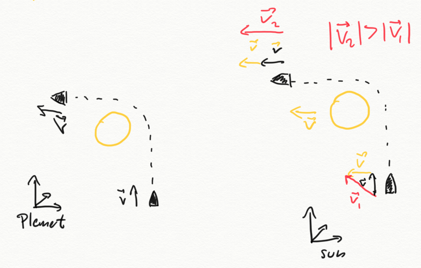
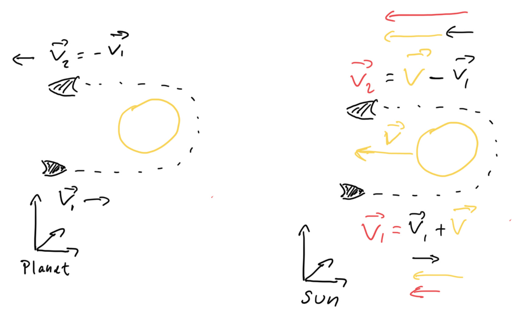

# Bevægelsesmængde

Bevægelsesmængden er produktet af et objekts masse ganget med dets hastighed. Bevægelsesmængden har en størrelse og en retning og bliver derfor beskrevet med vektoren, $\(\vec{p}=m\cdot \vec{v}\)$.

Newton definerede kraften som den tidsafledte af bevægelsesmængden i sin 2. lov ved, 

$$ \vec{F} =\frac{d \vec{p}}{dt} = \frac{d m\vec{v}}{dt} = m\cdot \vec{a}, $$

hvor jeg har brugt, at den tidsafledte af hastigheden jo er accelerationen. 

Hvis der ikke er nogen ekstern kraft, $\( \vec{F} = 0 \)$,  siger Newtons 1. lov at et objekt vil bevæge sig med lineært med konstant hastighed eller ligge stille. Hvis vi ser på bevægelsesmængden giver det,
$\( \vec{F} = 0 \Leftrightarrow  (m\vec{v})' = 0  \Leftrightarrow m\vec{v} = \vec{k}  \)$. Vi har altså at hastigheden gange massen er konstant. Udtrykket er at vektoren for hastigheden er lig en konstant vektor. Det viser at bevægelsesmængden er bevaret i alle retningen. Det mest naturlige er at dele bevægelsen op i en bevægelse langs x-aksen og en bevægelse langs y-aksen. 

For to partikler, med bevægelsesmængden 

$$\vec{p}_1 ,\vec{p}_2$$ 

giver det skrevet ud

$$\Delta p_x = \Delta p_{1x}+\Delta p_{2x} = (v_{1x}-u_{1x})\cdot m1+(v_{2x}-u_{2x})\cdot m2 = 0 $$

$$\Delta p_y = \Delta p_{1y}+\Delta p_{2y} = (v_{1y}-u_{1y})\cdot m1+(v_{2y}-u_{2y})\cdot m2 = 0 $$

Hvis man omskriver det giver det

$$\Delta p_{1x}=-\Delta p_{2x}$$
$$\Delta p_{1y}=-\Delta p_{2y}.$$

Den bevægelsesmængde den ene partikel mister ved kollision får den anden i begge dimensioner.

## Bevægelse i 1 dimension

I dette afsnit vil vi se på bevægelse som kun foregår i en dimension. Vi vil undersøge bevægelsesmængden for stød mellem to partikler. Det gør os i stand til at besvare flere interessante spørgsmål. 
* Hvornår vil to kugler følges ad efter en kollision og hvornår vil de blive slået fra hinanden. 
* Hvad sker der hvis den ene kugle er meget tungere end den anden.
* Hvad sker der for en kugle med lille masse hvis den støder sammen med en kugle med stor masse?
 
I følgende simulering er massen af de to kugler ens og hastigheden af kugle et er sat til $\(1\text\{m/s}^2\)$ men kugle to ligger stille.

**kode:**
[https://glowscript.org/#/user/mps/folder/bevaegelsesmaengde/program/p1](https://glowscript.org/#/user/mps/folder/bevaegelsesmaengde/program/p1)

* Beskriv hvad der sker i simuleringen.
* Hvordan kan I se at der er bevarelse af bevægelsesmængden?

Vi vil nu kvalitativt undersøge hvornår kuglerne følges ad og hvornår de separeres efter kollision. Til det skal I ændre på massen af kuglerne. Det gøres ved at ændre på værdierne, **m1** og **m2** i koden 6. og 7. linje.

Prøv at ændre på masserne og afgør hvad der skal gælde for at

* Kuglerne følges ad.
* Kuglerne spredes.
* Prøv at forklar resultaterne ud fra bevarelse af bevægelsesmængden.
 
For at kunne undersøge bevægelsesmængden kvantitativt laver vi grafer over bevægelsesmængden.

Vi starter igen med kugler med samme masse. 

**kode:**
[https://glowscript.org/#/user/mps/folder/bevaegelsesmaengde/program/p2](https://glowscript.org/#/user/mps/folder/bevaegelsesmaengde/program/p2)

* Beskriv de to grafers forløb i forhold til kuglernes bevægelse.
* Forøg massen af kugle to og gentag og argumenter for at der er bevarelse af bevægelsesmængden.
* Prøv at give kugle 2 en starthastighed forskellig fra nul, **v2**.

Ved at vælge s=3, kan I plotte en graf over hastigheden i stedet for bevægelsesmængden.
* Prøv at gør kugle 1 meget tungere end kugle to og se hvad der sker.
* Hvor meget kan man relativt forøge hastigheden af den lette kugle.
* Prøv at relater det til baseball, hvor en relativt let bold rammes af et boldtræ med en spiller bag med samletset stor masse.
* Prøv at give begge kugler den samme hastighed, modsatrettet men meget forskellig masse og beskriv hvad der sker.

# Gravity assist
De to Voyager sonderne er blevet sendt fra jorden i 1977 som en deep space mission. I 2020 var voyager 1 nået en afstand af 22.2 milliarder km fra Solen. De skal så langt væk fra jorden som muligt og sende information tilbage til jorden. Voyger sonderne har også ting fra jorden i tilfælde af at de møder alians. For at komme ud af Solens tyngdefelt skal sonderne have en enorm fart. Det får de primært ved at lave gravitationel slynge, på engelsk sling shot, omkring planeterne i solsystemet.

Voyager 1 rumsonden blev affyret fra Jorden og fløj tæt forbi Jupiter, Saturn, Uranus og Neptun. Selvom det ikke var hovedformålet har det givet fantastiske billeder af de fjerne planeter. Den primære grund til at passere planeterne er at bruge deres tyngdefelt til at accelerere rumsonderne og give dem fart nok på til at undslippe Solens tiltrækning.

Figur 1 viser en animation af Voyager 1 der passere Jupyter og både skifter retning og får større fart. 

Figur 1, Animation af Voyager 1

### Øvelse
* Brug animatinen til at bestemme Voyager 1 rumsondens fart ved affyring fra fra Jorden. Sammenlign med Jordens fart omkring Solen som er ca 30km/s.
* Brug energibevarelse til at argumenterer for at den kinetiske energi bliver mindre på vej mod Jupiter. Argumenter for at farten derfor aftager på vej mod Jupiter.
* Hvor meget ekstra fart får rumsonden ved gravity assist fra Jupyter (ca.) ?

Formlen for undvigelseshasgithed er 
$$v = \sqrt{\frac{2\cdot G\cdot M}{R}}.$$
Hvor, *M* er solens masse, *G*, gravitationskonstanten og *R* afstanden til Solen.
* Beregn Voyagers undvigelseshastighed efter mødet med Jupyter. Har sonden en tilstrækkelig hastighed til at undslippe Solsystemet?

## 1D

Når rumsonderne kommer tæt på planeter bliver de påvirket af planeternes tyngdefelt. Da der ikke er noget friktion vil den kinetiske energi være bevaret. Vi kan derfor betragte et gravity assist som et perfekt elastisk stør.

Nedenfor er en simulation hvor $\( m2=1000\cdot m1 \)$ og vi plotter hastigheden.

**kode:**
[https://glowscript.org/#/user/mps/folder/bevaegelsesmaengde/program/ga1](https://glowscript.org/#/user/mps/folder/bevaegelsesmaengde/program/ga1)

* Beskriv hvordan hastigheden ændrere sig for m1
* Prøv at ændre på hastighedn af $\(m2\)$, så den er i samme retning som **m1**. Hvad betyder det for hastigheden af **m1** efter et stød
* Hvornår får m2 størst hastighedsforøgelse.

## 2d
Som I kan se i figur 2 har vi brug for to dimensiner for at forklare Voygers gravity assist ud af solsystemet.

### Simulering i 2.d
Simuleringen viser en rumsonde som kommer forbi en planet. 

**kode:**
[https://glowscript.org/#/user/mps/folder/bevaegelsesmaengde/program/ga2](https://glowscript.org/#/user/mps/folder/bevaegelsesmaengde/program/ga2)

### Øvelse
* Beskriv sondens hastighedsgraf hvor I beskriver hastigheden før mødet med planeten og efter.
* Brug Newtons 2. lov til at forklare hvorfor sonden får mere fart på når den nærmer sig planeten.
* Brug igen Newtons 2. lov til at forklare hvorfor sonden mister fart når den bevæger sig væk fra planeten.
* Vurder hvor stor ændringen i hastigheden for den lille rumsonden er. 
* Undersøg om der er bevarelse af bevægelsesmængden. I kan se på hver dimension for sig.
* Lav om på hastigheden af den røde og se om I kan få mere fart på.
* Prøv også om I kan bremse sonden, det er lidt svært men rigtigt praktisk hvis man skal lande et sted. 

## Teoretisk forklaring
Gravity assist kan forklares med vektorer. Figur 3 viser til venstre en rumsonde som flyver forbi en planet og derved skifter retning. Koordinatsystemet følger planeten som står stille i dette billed. Rumsondens fart er den samme når den kommer imod planeten som når den forlader planeten, men hastigheden er ændret, retningen.

Til højre er koordinatsystemet placeret i Solen og planetn bevæger sig nu med en hastighed. I dette eksempel har rumsonden og planeten samme hastighed langs x-aksen og rumsonden har også en hastighed langs y-aksen. Den samlede hastighedsvektor er tegnet rød. Som før skifter rumsondens fart retning ved passage af planeten og de to vektorer peger nu i samme retning. Den resulterende vektor er længere efter passagen, hvilket betyder at rumsonden har fået en større hastighed. 

Figur 2, gravity assist 2d.

Den maksimale effekt kommer hvis rumsondens hastighed er modsatrettet planeten den paserer. Figur 4 viser igen til venstre hvordan tyngdefeltet fra planeten kan ændre retningen for rumsonden hvis vi bruger planetens referenceramme. Til højre ses det at med Solen som refrence skal runsondens hastighedsvektor adderes med planetens. Ved maksimalt gravity assist går de to hastighedsvektorer fra at være anti-parallelle til at være parallelle hvilket giver en højere hastighed for rumsonden. 

Figur 3, maksimal effekt.

Der er identificeret 9 forskellige formet for gravity assist.

